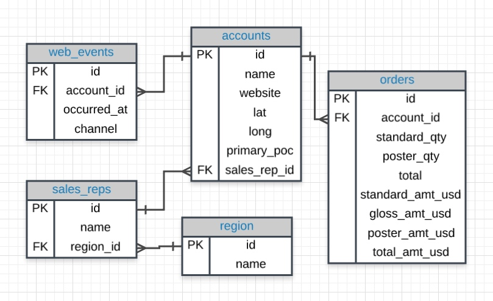

## day1 今日导学

### 前面的话

同学们，今天是我们开课的第一天。为了能够顺畅的完成7天项目，有几个需要注意的问题：

- 全部内容在Uda网站完成
- 项目也在Uda网站上完成，记得完成一点后点保存
- 项目完成后需要在最后部分提交
- 如果网站有奇怪的问题，请安装Chrome浏览器后再试

--pic testing--

### 今日目标

今天的目标是数据分析的3个大的理论做学习了解，暂不需要代码的调整。首先我么你要完成 **/数据类型/** 这一节，里面介绍了数据的知识（同学喵，要做数据分析，你要懂得数据是啥啊），接下来你也要完成 **/描述统计学基础/** （别怕，就是回顾下平均值、中位数和众数就好了），最后你要在看一下**/数据分析过程/**（敲黑板！这个部分就是数据分析的流程了，套路！快来学！）。助教大大还操碎了心的把这3部分的小结列了出来，方便大家逐条完成：P

1. 数据类型（了解数据和数据的类型）
   1. 数据是什么？它为什么如此重要？
   2. 数据类型（定量数据与分类数据）
   3. 练习：数据类型（定量数据与分类数据）
   4. 数据类型（定序与定类）
   5. 数据类型（连续与离散）
   6. 数据类型总结
   7. 练习：数据类型（定序与定类）
   8. 练习：数据类型（连续与离散）

2. 描述统计学基础（学习描述统计学的一些基础概念）
   1. 概括统计简介
   2. 集中趋势测量（平均值）
   3. 练习：集中趋势测量（平均值）
   4. 集中趋势测量（中位数）
   5. 练习：集中趋势测量（中位数）
   6. 集中趋势测量（众数）
   7. 练习：集中趋势测量（众数）

3. 数据分析过程（理解数据分析过程）
   1. 数据分析师解决的问题
   2. 数据分析过程的概述
   3. 数据分析过程练习
   4. 数据分析中的常用包概述
   5. 练习：数据分析中的常用包概述

4. （！选学，项目不要求！）数据结构和循环

   1. 列表
   2. 解决方案：列表
   3. For循环
   4. 解决方案：For循环
   5. While循环
   6. 解决方案：While循环
   7. 其他数据结构

### 助教叨叨

   写下这些絮叨的助教大大是一个（自认为）又帅又认真的大龄IT男，他用了8个月0基础完成了数据分析初级，高级，还参与了新Python课程的测试。如果用1个字对这段经历做总结，那就是：充实（，，，2个字了）。长话短说，自我突破是很痛苦的，Uda的这门课很好的特色小结如下：

   1. 第一，能够用得到。要知道，学得再好，用不起来也白搭。数据分析的场景越来越多，数据集也非常多，还有各种竞赛，如果想用起来，大环境已经非常成熟了。而且在工作也确实有很多机会使用，比如之前自己用excel公式做了半自动化的报告就觉得很好了，学了课程才会了python这种更加风骚的操作。
   2. 第二，学习曲线科学。不要会错意，对于初入门的小白来讲，课程还是挺难的。来听听想毕业都要会什么：Python语言、SQL语言、统计学、数据分析思维、A/B测试、Anaconda环境、Sublime IDE……。害不害怕？好了，不哭了……要知道Uda的学费没白交。Uda收了钱以后，还是做了很多努力平滑大家的学习曲线的：
      1. 课程是项目制。4个项目就要交4个报告，还有非常专业（…严格的）评审老师。
      2. 微信通关群。在学习的过程中，每个项目有通关群，群里有助教老师耐心的解决问题。
      3. 论坛和1对1辅导。如果涉及代码比较复杂还可以发论坛（好多问题论坛里都有的……没忍住剧透了）。最后还有大招每周1次1对1电话辅导。
      4. Uda在非常努力的提供反馈，甚至是不厌其烦的催促你在学，班主任小姐姐助教大大是非常认真的。
   3. 第三，自我的突破。之前在知乎周刊看到一句话：。觉得会写代码又拽又神秘。也陆续买书瞎看，进展可以说…顶Uda一周的学习内容吧。在这次学习期间，不但一下入门了Python，R，JavaScript（用于数据分析的差不多了，目标明确，我是要用代码来分析数据的！）还学会了怎么应对统计分析、数据可视化、探索性数据分析、机器学习等等实际工作的实现。接下来就是自己积累了。

   作为第一天入坑，同学们除了有些慌张，是不是还有点小激动？别忘了大家承诺的时间，一切准备就绪，就等你到达战场了，加油！

